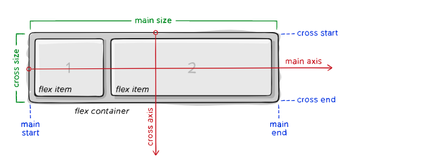
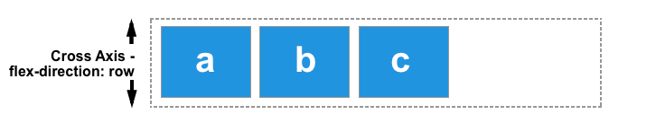

# CSS flexbox

The Flexible Box Module, usually referred to as flexbox, was designed as a one-dimensional layout model, and as a method that could offer space distribution between items in an interface and powerful alignment capabilities.

When we describe flexbox as being one dimensional we are describing the fact that flexbox deals with layout in one dimension at a time — either as a row or as a column. This can be contrasted with the two-dimensional model of CSS Grid Layout, which controls columns and rows together.

Since flexbox is a whole module and not a single property, it involves a lot of things including its whole set of properties. Some of them are meant to be set on the container (parent element, known as “flex container”) whereas the others are meant to be set on the children (said “flex items”).

If “regular” layout is based on both block and inline flow directions, the flex layout is based on “flex-flow directions”. Please have a look at this figure from the specification, explaining the main idea behind the flex layout.

## The two axes of flexbox

When working with flexbox you need to think in terms of two axes — the main axis and the cross axis. The main axis is defined by the flex-direction property, and the cross axis runs perpendicular to it. Everything we do with flexbox refers back to these axes, so it is worth understanding how they work from the outset.



Items will be laid out following either the main axis (from main-start to main-end) or the cross axis (from cross-start to cross-end).

### The main Axis

The main axis is defined by `flex-direction`, which has four possible values:

- `row`
- `row-reverse`
- `column`
- `column-reverse`

Should you choose row or row-reverse, your main axis will run along the row in the **inline direction**.


Choose column or column-reverse and your main axis will run from the top of the page to the bottom — in the **block direction**.


- **main axis** - of a flex container is the primary axis along which flex items are laid out. Beware, **it is not necessarily horizontal; it depends on the flex-direction property** (see below).
- **main-start | main-end** – The flex items are placed within the container starting from main-start and going to main-end.
- **main size** – A flex item’s width or height, whichever is in the main dimension, is the item’s main size. The flex item’s main size property is either the ‘width’ or ‘height’ property, whichever is in the main dimension.

### Cross Axis

The cross axis runs perpendicular to the main axis, therefore if your flex-direction (main axis) is set to `row` or `row-reverse` the cross axis runs down the columns.**Its direction depends on the main axis direction**.



If your main axis is `column` or `column-reverse` then the cross axis runs along the rows.


- **cross axis** – The axis perpendicular to the main axis is called the cross axis. Its direction depends on the main axis direction.
- **cross-start | cross-end** – Flex lines are filled with items and placed into the container starting on the cross-start side of the flex container and going toward the cross-end side.
- **cross size** – The width or height of a flex item, whichever is in the cross dimension, is the item’s cross size. The cross size property is whichever of ‘width’ or ‘height’ that is in the cross dimension.

## Flex container

### display

This defines a flex container; inline or block depending on the given value. It enables a flex context for all its direct children.

```css
.container {
  display: flex; /* or inline-flex */
}

```

*Note that CSS columns have no effect on a flex container.*

### flex-direction

This establishes the main-axis, thus defining the direction flex items are placed in the flex container. Flexbox is (aside from optional wrapping) a single-direction layout concept. Think of flex items as primarily laying out either in horizontal rows or vertical columns.

```css
.container {
  flex-direction: row | row-reverse | column | column-reverse;
}
```

## Justify Content

This defines the alignment along the **main axis**. It helps distribute extra free space leftover when either all the flex items on a line are inflexible, or are flexible but have reached their maximum size. It also exerts some control over the alignment of items when they overflow the line.

```css
.container {
  justify-content: flex-start | flex-end | center | space-between | space-around | space-evenly | start | end | left | right ... + safe | unsafe;
}
```


## Align Items

This defines the default behavior for how flex items are laid out along the **cross axis** on the current line. Think of it as the justify-content version for the cross-axis (perpendicular to the main-axis).

## Additional Reading

- [Basic concepts of flexbox : Mozilla](https://developer.mozilla.org/en-US/docs/Web/CSS/CSS_Flexible_Box_Layout/Basic_Concepts_of_Flexbox
)

- [A Complete Guide to Flexbox : CSSTricks](https://css-tricks.com/snippets/css/a-guide-to-flexbox/)

- [Cheat Sheets : Container properties](cheet-sheets/A%20-%20Container%20Properties.pdf)

- [Cheat Sheets : Child properties](cheet-sheets/B%20-%20Child%20Properties.pdf)
